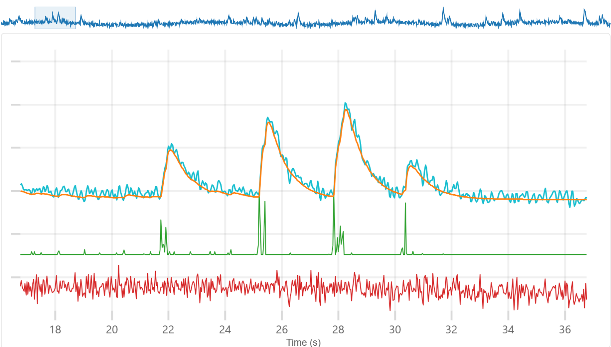

# CaLab

Calcium imaging analysis tools

[](LICENSE)
[](https://github.com/miniscope/CaLab/actions/workflows/ci.yml)
[](https://miniscope.github.io/CaLab/)
[](https://pypi.org/project/calab/)



## What is CaLab?

CaLab is a suite of browser-based tools for calcium imaging analysis. The tools run entirely in the browser — no installation, no server, no data upload. Load your fluorescence traces, tune deconvolution parameters with real-time visual feedback, and export the results.

The flagship app, **CaTune**, lets you interactively adjust deconvolution parameters (rise time, decay time, sparsity) while watching the solver update in real time. The deconvolution engine is a FISTA solver written in Rust and compiled to WebAssembly, running in Web Workers for parallel multi-cell processing.

A companion **Python package** (`calab`) provides the same deconvolution algorithm in Python, with data exchange utilities for round-tripping parameters between the browser tools and analysis scripts. An optional **community sharing** feature (powered by Supabase) lets users share and browse deconvolution parameters across datasets and indicators.

## Quick Start (Scientists)

1. Open **[CaTune](https://miniscope.github.io/CaLab/CaTune/)** in your browser
2. Try the built-in demo data to explore the interface
3. Drag and drop your own `.npy` or `.npz` file containing calcium traces
4. Adjust parameters with the sliders and observe real-time deconvolution
5. Export your tuned parameters as JSON for use in analysis pipelines

## Python Package

```bash
pip install calab
```

The `calab` Python package is the Python entrypoint to CaLab. It runs the same FISTA deconvolution algorithm in Python, and provides utilities for exchanging data with the web apps — load CaTune export JSON files, prepare traces for the browser tool, and run batch deconvolution with tuned parameters.

> **Note:** The Python package is under active development — major updates are planned.

See [`python/README.md`](python/README.md) for full API documentation.

## Apps

| App                    | Description                                        | Status |
| ---------------------- | -------------------------------------------------- | ------ |
| [CaTune](apps/catune/) | Interactive calcium deconvolution parameter tuning | Stable |

## Monorepo Structure

```
.
├── apps/
│   ├── catune/                  # SolidJS SPA — deconvolution parameter tuning
│   └── carank/                  # SolidJS SPA — trace quality ranking
├── packages/
│   ├── core/                    # @calab/core — shared types, pure math, WASM adapter
│   ├── compute/                 # @calab/compute — worker pool, warm-start cache
│   ├── io/                      # @calab/io — file parsers, validation, export
│   ├── community/               # @calab/community — Supabase DAL, submission logic
│   ├── tutorials/               # @calab/tutorials — tutorial types, progress persistence
│   └── ui/                      # @calab/ui — shared layout components
├── wasm/
│   └── catune-solver/           # Rust FISTA solver crate (compiled to WASM)
├── python/                      # Python companion package
├── docs/                        # Documentation
├── scripts/                     # Build and deploy scripts
└── supabase/                    # Supabase config
```

## Packages

| Package                                   | Description                                                          |
| ----------------------------------------- | -------------------------------------------------------------------- |
| [`@calab/core`](packages/core/)           | Shared types, pure utilities, domain math, WASM adapter              |
| [`@calab/compute`](packages/compute/)     | Generic worker pool, warm-start caching, kernel math, downsampling   |
| [`@calab/io`](packages/io/)               | File parsers (.npy/.npz), data validation, cell ranking, JSON export |
| [`@calab/community`](packages/community/) | Supabase data access layer for community parameter sharing           |
| [`@calab/tutorials`](packages/tutorials/) | Tutorial type definitions, progress persistence (localStorage)       |
| [`@calab/ui`](packages/ui/)               | Shared SolidJS layout components (DashboardShell, panels, cards)     |

## Development Quick Start

### Prerequisites

- **Node.js 22** (LTS) — use `.nvmrc`: `nvm use`
- **Rust stable** + **wasm-pack** — only needed if modifying the solver
- **Python >= 3.10** — only needed for the Python package

### Setup

```bash
git clone https://github.com/miniscope/CaLab.git
cd CaLab
nvm use
npm install
npm run dev
```

### Key Scripts

| Script                | Description                            |
| --------------------- | -------------------------------------- |
| `npm run dev`         | Start CaTune dev server                |
| `npm run build`       | Build WASM + all apps                  |
| `npm run build:pages` | Build + combine dist for GitHub Pages  |
| `npm run build:wasm`  | Compile Rust solver to WASM            |
| `npm run test`        | Run Vitest tests across all workspaces |
| `npm run lint`        | Run ESLint                             |
| `npm run typecheck`   | Run TypeScript type checking           |
| `npm run format`      | Format all files with Prettier         |

See [`docs/CONTRIBUTING.md`](docs/CONTRIBUTING.md) for the full development guide.

## Documentation

- [Architecture](docs/ARCHITECTURE.md) — module layout, dependency DAG, state management, boundaries
- [Contributing](docs/CONTRIBUTING.md) — setup, scripts, code style, CI
- [Changelog](docs/CHANGELOG.md) — release history
- [New App Guide](docs/NEW_APP.md) — adding a new app to the monorepo
- [CaTune](apps/catune/README.md) — CaTune app documentation
- [WASM Solver](wasm/catune-solver/README.md) — Rust FISTA solver documentation
- [Python Package](python/README.md) — Python companion package

## Tech Stack

- **Frontend:** SolidJS + TypeScript + Vite
- **Solver:** Rust + wasm-pack (WebAssembly)
- **Charts:** uPlot
- **Community:** Supabase (optional)
- **Styling:** Pure CSS with custom properties

## Versioning

The monorepo uses a single `v*` tag for all web apps and packages (e.g., `v2.0.4`). The Python package has a separate `py/v*` tag series. See the [Changelog](docs/CHANGELOG.md) for release history.

## License

[MIT](LICENSE) — Copyright (c) 2025 Daniel Aharoni

## Contributing

Contributions are welcome! See [`docs/CONTRIBUTING.md`](docs/CONTRIBUTING.md) for setup instructions, code style guidelines, and the CI pipeline. Bug reports and feature requests can be filed via [GitHub Issues](https://github.com/miniscope/CaLab/issues).
